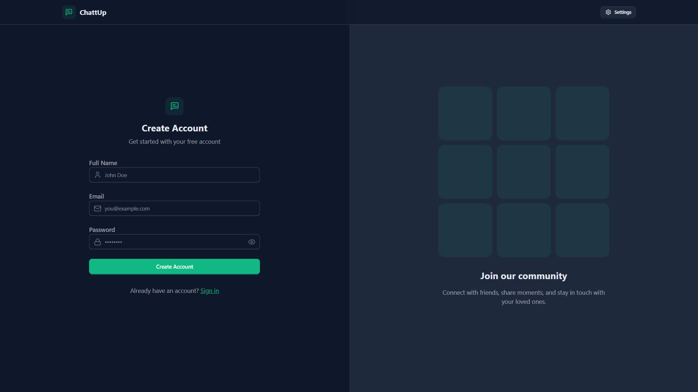
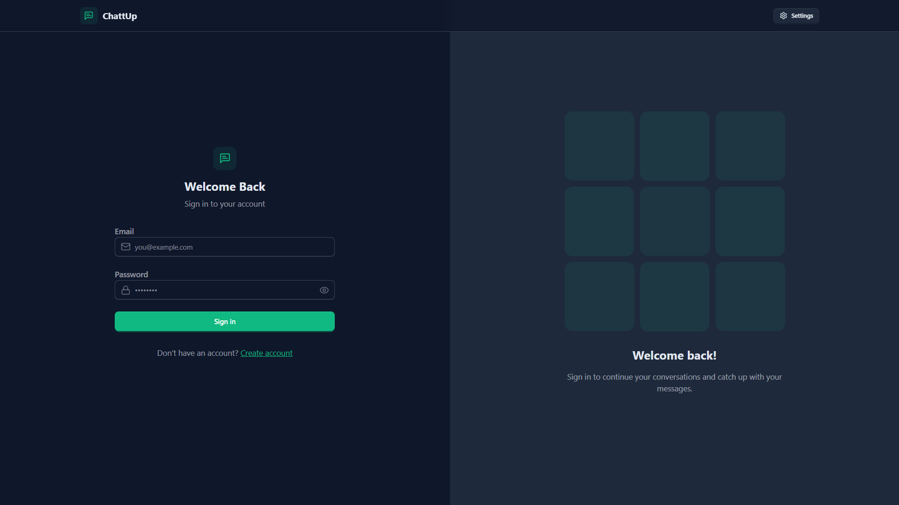
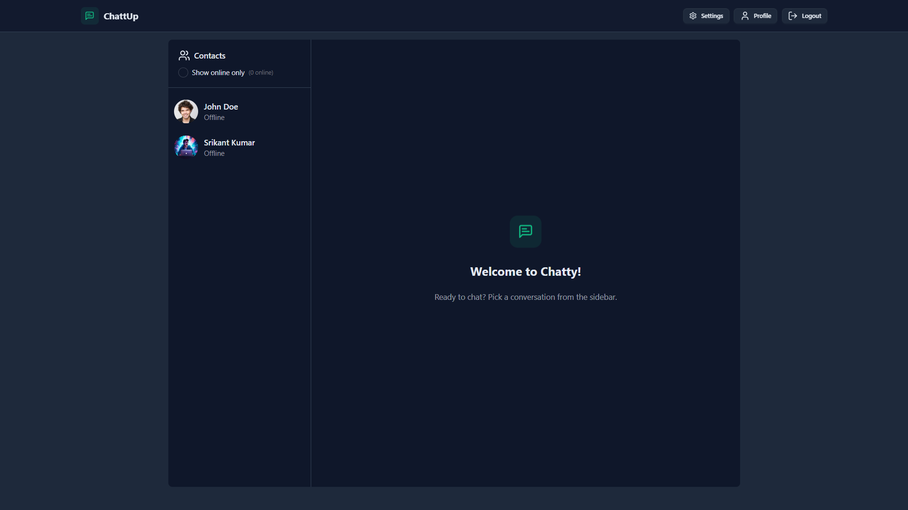
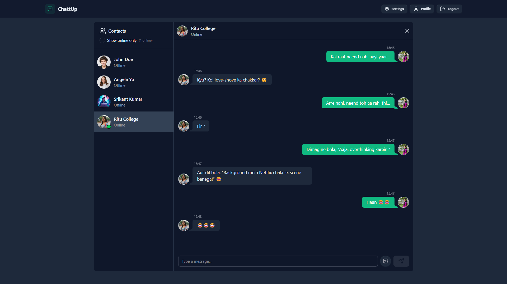
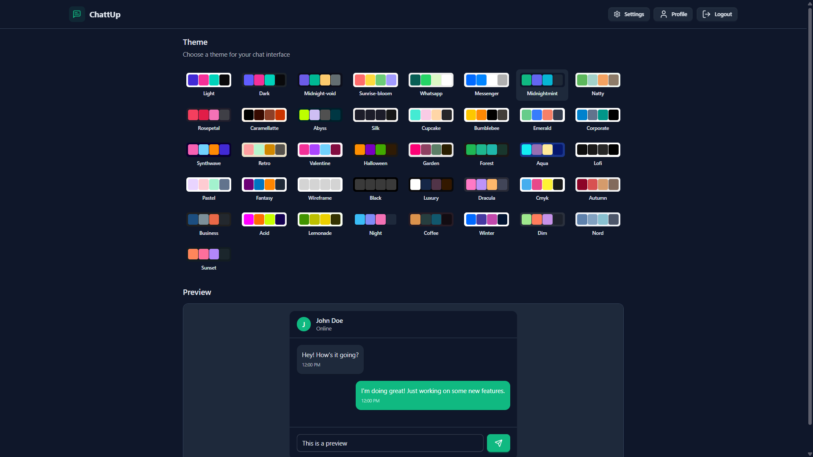
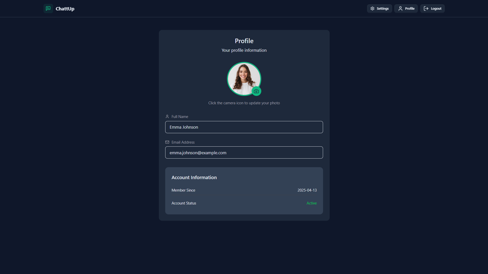

# Real-Time Chat App

This is a real-time chat application where users can create an account, log in, and instantly chat with others. Besides sending messages, users can upload images, see who is online, and customize how the app looks with different themes.

## What I Learned Building This

I created this project while learning from the [Codesistency YouTube Channel](http://www.youtube.com/@codesistency). Their tutorials helped me understand how to connect the frontend and backend, use secure login methods, and safely store passwords.

During this project, I also learned how to organize the codebase properly and build real-time features. It was a hands-on experience that helped me understand how full-stack web apps work—from both the frontend and backend sides.

---

## Table of Contents

- [Features](#features)
- [Tech Stack](#tech-stack)
- [Screenshots](#screenshots)
- [Installation](#installation)
- [Usage](#usage)
- [Folder Structure](#folder-structure)
- [Author](#author)

---

## Features


- **User Authentication:** You can securely sign up, log in, and log out.
- **Real-Time Messaging:** Send and receive messages instantly.
- **Image Uploads:** Share images in your chats.
- **Online Status:** See who's online in real-time.
- **Custom Themes:** Personalize the chat interface with different themes.
- **Responsive Design:** The app works great on both desktop and mobile devices.

---

## Tech Stack

### Frontend
- **React**: Used to build the user interface.
- **Vite**: Ensures fast development and efficient build processes.
- **Zustand**: Manages the state of the application.
- **TailwindCSS**: Handles the styling.
- **DaisyUI**: Provides pre-designed UI components.
- **React Router**: Manages navigation within the app.
- **React Toastify**: Displays notifications.
- **Socket.IO-client**: Enables real-time communication.

### Backend
- **Node.js**: Powers the server-side runtime.
- **Express**: Used to build the REST API.
- **Socket.IO**: Enables real-time communication.
- **MongoDB**: Serves as the database.
- **Mongoose**: Helps with MongoDB object modeling.
- **Cloudinary**: Used for image hosting.
- **JWT**: Manages authentication.
- **bcrypt**: Hashes passwords securely.

---

## Screenshots

### 1. **Sign-Up Page**


### 2. **Login Page**


### 3. **Home Page**


### 4. **Chat Interface**


### 5. **Settings Page**


### 6. **Profile Page**


---
## Installation Guide

**Prerequisites:**

* Node.js and npm installed.
* MongoDB database access.
* Cloudinary account.

**Steps:**

1.  **Clone the Repository:**

    ```bash
    git clone https://github.com/Rajiv-0920/Realtime-Chat-App.git
    cd chat-app
    ```

2.  **Configure the Backend:**

    * Navigate to the backend directory:

        ```bash
        cd backend
        ```

    * Create a `.env` file in the `backend` directory and fill it with your credentials:

        ```
        MONGODB_URI=your_mongodb_connection_string
        PORT=5001
        JWT_SECRET=your_jwt_secret
        NODE_ENV=development # or production
        CLOUDINARY_CLOUD_NAME=your_cloudinary_cloud_name
        CLOUDINARY_API_KEY=your_cloudinary_api_key
        CLOUDINARY_API_SECRET=your_cloudinary_api_secret
        ```

        **Important:** Replace the placeholder values with your actual MongoDB URI, JWT secret, and Cloudinary credentials.

    * Install backend dependencies:

        ```bash
        npm install
        ```

3.  **Configure the Frontend:**

    * Navigate to the frontend directory:

        ```bash
        cd ../frontend
        ```

    * Install frontend dependencies:

        ```bash
        npm install
        ```

4.  **Start the Servers:**

    * Start the backend server:

        ```bash
        cd ../backend
        npm run dev
        ```

    * Start the frontend server:

        ```bash
        cd ../frontend
        npm run dev
        ```

5.  **Access the Application:**

    * Open your web browser and go to:

        ```
        http://localhost:5173
        ```

## Usage

* **Create an Account:** If you're new, sign up to make an account.
* **Log In:** If you already have an account, enter your details to log in.
* **Start a Conversation:** Pick someone from the list on the side and start chatting.
* **Change the Look:** Go to the settings to change how the app looks.
* **Update Your Info:** You can change your profile picture and see your account details in the profile section.


### Folder Structure

    chat-app/
    ├── backend/
    │   ├── src/
    │   │   ├── controllers/
    │   │   ├── lib/
    │   │   ├── middleware/
    │   │   ├── models/
    │   │   ├── routes/
    │   │   ├── seeds/
    │   │   └── index.js
    │   ├── .env
    │   ├── package.json
    │   └── ...
    ├── frontend/
    │   ├── src/
    │   │   ├── components/
    │   │   ├── constants/
    │   │   ├── lib/
    │   │   ├── pages/
    │   │   ├── store/
    │   │   ├── App.jsx
    │   │   ├── main.jsx
    │   │   └── index.css
    │   ├── public/
    │   │   ├── screenshots/
    │   │   │   ├── signup.png
    │   │   │   ├── login.png
    │   │   │   ├── home.png
    │   │   │   ├── chat.png
    │   │   │   ├── settings.png
    │   │   │   └── profile.png
    │   ├── package.json
    │   ├── vite.config.js
    │   └── ...
    ├── package.json
    └── README.md

## Author

I'm Rajiv, and I built this chat app. I learned a lot from the easy-to-follow videos on the [Codesistency YouTube Channel](http://www.youtube.com/@codesistency youtube channel).  They really helped me understand how to make it work.

## Contact

- **Rajiv Kumar**
- **Email:** kumarrajiv0920@gmail.com
- **GitHub:** [My GitHub Profile](https://github.com/Rajiv-0920)
- **Linkedin:** [Connect with me on LinkedIn](www.linkedin.com/in/rajivkumar0920)